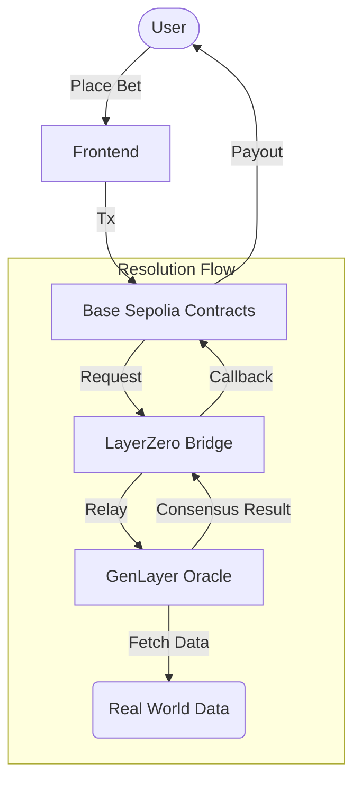

# Limitless Homage

[](https://opensource.org/licenses/MIT)

**Binary prediction markets with trustless, on-chain resolution.**

[Limitless Inspired](https://limitless.exchange/) | [GenLayer Powered](https://genlayer.com/)

## 📖 About The Project

This project is a Limitless Homage. It consists of a prediction market platform that leverages **GenLayer's Intelligent Contracts** to resolve markets without centralized oracles. By using GenLayer validators to fetch real-world data and reach consensus, we eliminate the trust assumption required by traditional oracle solutions.

### Key Features

- **Trustless Resolution**: Markets are resolved by a consensus of validators executing Python logic on GenLayer.
- **Cross-Chain Architecture**: Seamless bridging between Base (resolution request) and GenLayer (data fetching) via LayerZero.
- **Automated Lifecycle**: From bet creation to payout, the entire flow is handled by smart contracts.

## 🏗️ Architecture

The system consists of three main components working in harmony:

1.  **Frontend**: User interface for placing bets and viewing markets.
2.  **Base Contracts**: Manages funds, betting logic, and payouts on the Base blockchain.
3.  **GenLayer Oracle**: Intelligent contracts that fetch external data and push results back to Base.



## 🚀 Getting Started

Follow these steps to set up the project locally.

### Prerequisites

- Node.js (v18+)
- npm or pnpm
- A customized `contracts/.env` file with your `PRIVATE_KEY`.

### Installation

1.  **Install Contracts Dependencies**

    ```bash
    cd contracts
    npm install
    cp .env.example .env
    ```

2.  **Install Frontend Dependencies**

    ```bash
    cd ../frontend
    npm install
    cp .env.example .env
    ```

3.  **Install Bridge Service Dependencies**

    ```bash
    cd ../bridge/service
    npm install
    cp .env.example .env
    ```

## 💻 Usage

### 1. Deploy Contracts (Base Sepolia)

> **Note:** Uses MockUSDL as the betting token. For production, deploy with any ERC-20 by passing its address to the factory constructor.

```bash
cd contracts

# 1. Deploy MockUSDL token
npx hardhat run scripts/deploy-usdl.ts --network baseSepolia
# Note the deployed address

# 2. Deploy BetFactory (pass token address)
MOCK_USDL_ADDRESS=0x... npx hardhat run scripts/deploy-factory.ts --network baseSepolia
# Note the deployed factory address

# 3. Configure factory with bridge receiver (after bridge setup)
FACTORY_ADDRESS=0x... BRIDGE_RECEIVER_ADDRESS=0x... npx hardhat run scripts/configure-factory.ts --network baseSepolia
```

### 2. Configure Bridge

Follow the [GenLayer Studio Bridge Boilerplate](https://github.com/genlayer-foundation/genlayer-studio-bridge-boilerplate) guide to set up the relay service. You will need to deploy:

- **BridgeSender** on GenLayer
- **BridgeReceiver** on Base (linked to your BetFactory)

### 3. Run Frontend

```bash
cd frontend
npm run dev
```

Open [http://localhost:3000](http://localhost:3000) to view the application.

## 🧪 Testing

We provide comprehensive test scripts for different parts of the stack.

| Component     | Command               | Description                                   |
| :------------ | :-------------------- | :-------------------------------------------- |
| **E2E Flow**  | `npm run test:e2e`    | Full flow: Create -> Bet -> Resolve -> Bridge |
| **Oracle**    | `npm run test:oracle` | Deploy and test GenLayer oracle logic         |
| **Contracts** | `npx hardhat test`    | Unit tests for Solidity contracts             |

## 📄 License

Distributed under the MIT License. See `LICENSE` for more information.
